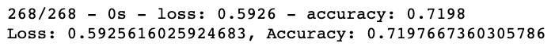

In this module, neural networks is explored and implemented using the TensorFlow platform in Python. The background and history of computational neurons was discussed as well as current implementations of neural networks as they apply to deep learning. Discussed the major costs and benefits of different neural networks and compare these costs to traditional machine learning classification and regression models. Additionally, practiced implementing neural networks and deep neural networks across a number of different datasets, including image, natural language, and numerical datasets. Finally, learned how to store and retrieve trained models for more robust uses.

### Overview of the statistical analysis:

In this module challenge, the data analysis is performed to help a foundation (Alphabet Soup) predict where to make investments. Knowledge of machine learning and neural networks is used. The features in the provided dataset is used to create a binary classifier that is capable of predicting whether applicants will be successful if funded by Alphabet Soup.

In this challenge, three technical analysis deliverables and this written report are required:

- Deliverable 1: *Preprocessing Data for a Neural Network Model*

- Deliverable 2: *Compile, Train, and Evaluate the Model*

- Deliverable 3: *Optimize the Model*

- Deliverable 4: *A Written Report on the Neural Network Model (README.md)*

### Results:

**Deliverable 1:** Preprocessing Data for a Neural Network Model:

Summary: *Using Pandas and the Scikit-Learn’s StandardScaler(), the dataset is preprocessed in order to compile, train, and evaluate the neural network model later in Deliverable 2.* 

**Preprocessed Dataset:**

**Deliverable 2:** Compile, Train, and Evaluate the Model:

Summary: *Using TensorFlow, a neural network is designed, or deep learning model, to create a binary classification model that can predict if an Alphabet Soup–funded organization will be successful based on the features in the dataset. A number of inputs is then considered before determining the number of neurons and layers in the model. Once the step is completed, the binary classification model is compiled, trained, and evaluated to calculate the model’s loss and accuracy.*

Adjustments made:

- Dropped the "EIN" and "NAME" columns
- Added two hidden nodes layer
- Assigned 80 and 30 number of hidden nodes for layer 1 and 2, respectively.
- Assigned output layer activation to "sigmoid"
- Assigned number of epochs to 100

**Evaluated Model Result:**

**The script for Deliverables 1 and 2 can be access via the link below:**

[Link to the Alphabet Soup Charity.ipynb](https://github.com/jsaltmd/Cryptocurrencies/blob/main/crypto_clustering.ipynb)

**Deliverable 3:** Optimize the Model:

Summary: *Using TensorFlow, model is optimized in order to achieve a target predictive accuracy higher than 75%. If an accuracy higher than 75% cannot be achieved, at least three attempts is made by performing the following adjustments:*

1. Adjusting the input data to ensure that there are no variables or outliers that are causing confusion in the model, such as:

* Dropping more or fewer columns.
* Creating more bins for rare occurrences in columns.
* Increasing or decreasing the number of values for each bin.

2. Adding more neurons to a hidden layer.

3. Adding more hidden layers.

4. Using different activation functions for the hidden layers.

5. Adding or reducing the number of epochs to the training regimen.

**First Attempt:**

Adjustments made:

- Dropped the "USE_CASE" column
- Added third hidden nodes layer
- Changed the number of hidden nodes
- Added a third hidden layer
- Changed output layer activation to "tanh"
- Reduced number of epochs to 80

**Evaluated Model Result:**

**Second Attempt:**

Adjustments made:

- Dropped the "USE_CASE" and "ORGANIZATION" columns
- Added third hidden nodes layer
- Changed the number of hidden nodes
- Added a third hidden layer
- Changed output layer activation to "linear"
- Increased number of epochs to 150

**Evaluated Model Result:**

**Third Attempt:**

Adjustments made:

- Dropped the "USE_CASE" and "ORGANIZATION" columns
- Reduced hidden nodes layer to one
- Changed the number of hidden nodes
- Changed output layer activation to "relu"
- Reduced number of epochs to 47

**Evaluated Model Result:**

**The script for Deliverable 3 can be access via the link below:**

[Link to the Alphabet Soup Charity Optimization.ipynb](https://github.com/jsaltmd/Cryptocurrencies/blob/main/crypto_clustering.ipynb)

**NOTE:** The AlphabetSoupCharity_Optimzation.h5 file was saved from the third optimization attempt.

### Summary:

**Deliverable 4:** A Written Report on the Neural Network Model:

Summary: *A written report summary on the performance of the deep learning model created for AlphabetSoup.*

1. Data Preprocessing

- What variable(s) are considered the target(s) for your model?

*The target considered was the "IS_SUCCESSFUL" column.*

- What variable(s) are considered to be the features for your model?

*The features considered are the rest of the columns in the preprocessed dataset which can be verified in the attached notebooks. See links above.*

- What variable(s) are neither targets nor features, and should be removed from the input data?

*For deliverable 1 and 2, the following variables: "EIN" and "NAME" were removed from the preprocessed data set.*

*For deliverable 3, the following variables: "EIN", "NAME", "USE_CASE" and/or "ORGANIZATION" were removed from the preprocessed data set.*

2. Compiling, Training, and Evaluating the Model

- How many neurons, layers, and activation functions did you select for your neural network model, and why?

*The number of neurons, layers, and activation functions are summarized in deliverable 1, 2, and 3 written results above. Those values and/or settings were choosen to match the required outputs for both deliverables 1 and 2 and to optimize/troubleshoot the model for deliverable 3.*

- Were you able to achieve the target model performance?

*No. The three attempts in Deliverable 3 to optimize the original predictive accuracy result of 73% from Deliverable 2 to a target model performance higher than 75%, produced an accuracy range results of 72% - 73%. Therefore, the accuracy did not changed or improved even with adjustments made. refer to results summary above*

- What steps did you take to try and increase model performance?

*Refer to the list of adjustments made on all three attempts in Deliverable 3 above.*

**Summary:** Based on the data analysis, the predictive results did not improve from the original target model performance of 73% even with optimization. Perhaps additional adjustments are needed to be made during preprocessing of the data or additional input data is needed in order to have a more meaningful result. perhaps a deep neural network model is not the best model for this type of analysis due to potential overfitting. I recommend to explore other models such as Logistic Regression, Support Vector Machine, or Random Forest classifiers can be used to determine which is robust and accurate model. Random forest models could be an option as it has been a staple in machine learning algorithms for many years due to their robustness and scalability. Both output and feature selection of random forest models are easy to interpret, and they can easily handle outliers and nonlinear data. Structurally speaking, random forest models are very similar to their neural network counterparts - Module 19.5.4.
